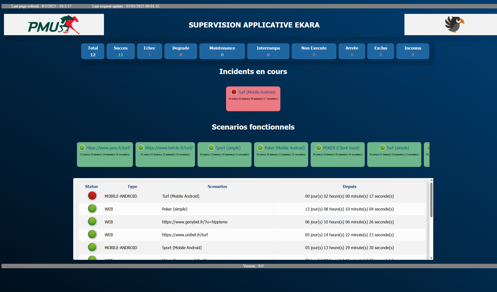
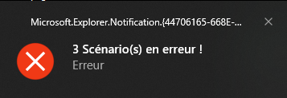
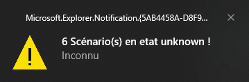

# Ekara-Console_Custom

<a href="https://api.ekara.ip-label.net/"> 

## Description
This [Powershell](https://learn.microsoft.com/powershell/scripting/overview) script lists all Ekara scenarios and displays their statuses in a dynamic HTML page.

For this, the script uses the Rest Ekara API [Ekara](https://ekara.ip-label.net/)

## Screens

## Requirements

-|version
--|:--:
Ekara plateform|>=25.1
PowerShell|>=5
.NET|>=4

(Account and password Ekara or APIKey)

Before running the script, you must enter your Ekara identifier (Account / Password or APIKey).

## Download

[github-download]: https://github.com/MrGuyTwo/Ekara-Console_Custom
 - [`Ekara-Console_Custom`][github-download]

## The main function
API Methods called : 

- auth/login
- results-api/scenarios/status?clientId={$client}

After retrieving the status of all Ekara scenarios, the script generates an HTML page. The page content is updated regularly (according to the configured frequency). The script must be restarted every 24 hours (Ekara token lifetime).
In the HTML page, the first carousel contains failed or degraded scenarios.
The second carousel contains functional scenarios.
(Scenarios that have been stopped or are undergoing maintenance are not displayed.)

In the PowerShell script, you can customize the following settings:
- Authentication method (1 = Without asking for an account and password / 2 = Requests the entry of an account and a password / 3 = With API-KEY)
- RefreshPage (HTML page refresh time)
- IntervalInventory (Delay between each REST API request)
- clientId (Ekara account ID)
- HTMLFile (HTML page name)
- HTMLLogo (Customer logo)

The script generates a Windows alert for failed or degraded scenarios.

